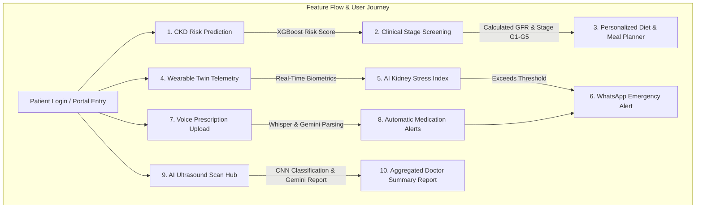

<div align="center">

# 🩺 NephroCare

**An AI-powered CKD care companion for early detection, personalized nutrition, and continuous monitoring.**


</div>

---

## Table of Contents

- [Why NephroCare is Needed](#why-nephrocare-is-needed)
- [Solution Overview](#solution-overview)
- [System Architecture](#system-architecture--data-flow)
- [Core Features](#core-features--machine-learning-models-used)
- [Feature Flow](#feature-flow--user-journey)
- [Database Schema & Datasets](#database-schema--datasets-used)
- [Getting Started](#running-the-application-locally)
- [Target Users](#target-users)
- [Disclaimer](#disclaimer)

---

## Why NephroCare is Needed

Chronic Kidney Disease (CKD) is a global public health crisis, affecting over **850 million people worldwide** - more than double the number of people with diabetes, and 20 times the number of people with cancer or HIV/AIDS.

CKD is a progressive, life-threatening condition often called a **"silent killer."** Because early stages typically show no physical symptoms, up to **90% of people with kidney damage are unaware of their condition** until their kidneys are near failure. By then, the damage is often irreversible, requiring dialysis or a transplant.

Managing kidney health means tracking lab parameters, blood pressure, daily symptoms, and restrictive diets (potassium, sodium, phosphorus, protein) - but patients face real barriers:

- Limited access to nephrologists, especially in remote areas
- Difficulty interpreting complex lab reports
- No daily, personalized nutritional guidance
- High cost and invasiveness of continuous monitoring

**NephroCare** breaks down these barriers with a non-invasive, accessible, intelligent home-care cockpit.

---

## Solution Overview

NephroCare integrates ML risk prediction, clinical stage screening, AI-assisted ultrasound diagnostics, speech-to-text voice prescription parsing, and real-time wearable telemetry into one patient-centered ecosystem - bridging clinical data and daily self-management for CKD patients.

**Responsive, mobile-first:** the dashboard cockpit stacks fluidly on phones and tablets - charts, dials, and telemetry all resize natively with no horizontal scrolling.

---

## System Architecture & Data Flow


---

## Core Features & Machine Learning Models Used

| Feature | Description | Models & Technology Stack |
|---|---|---|
| **CKD Risk Prediction** | Predicts CKD probability from clinical metrics (creatinine, blood pressure, etc.) | **XGBoost Classifier** (`models/ckd_risk_prediction_model.joblib`) |
| **CKD Stage Screening** | Classifies kidney damage stage (G1–G5) from lab values (eGFR, Urine ACR) | **XGBoost Classifier** (`models/ckd_stage_xgb.joblib`) with custom scaling pipelines |
| **AI Ultrasound Diagnostics** | Analyzes kidney ultrasound images for structural anomalies | **5-Class Custom PyTorch CNN** (`models/kidney_ultrasound_model.pth`) + **Gemini 2.5 Flash** for observations |
| **Voice Prescription Analyzer** | Transcribes doctor voice notes into medication & vital thresholds | **OpenAI Whisper (base)** + **Gemini API** for clinical entity parsing |
| **Food Safety & Meal Planner** | Analyzes food safety and generates kidney-friendly diet guides | **Gemini Developer API** + Indian Foods Dataset matching engine |
| **WhatsApp Health Assistant** | Proactive reminders for medication, diet adherence, checkups | **Twilio Messaging API** (WhatsApp sandbox gateway) |
| **Monitoring Dashboard** | Consolidated view of health logs, lab trends, and alerts | **Vite React SPA** with live telemetry socket linkages |

### Feature Flow & User Journey



---

## Database Schema & Datasets Used

### Entity-Relationship Diagram

PostgreSQL table relations for authentication, clinical profiles, symptom tracking, predictions, ultrasound logs, and food checks:

```mermaid
erDiagram
    nephrocare_users ||--o{ nephrocare_sessions : "has active"
    nephrocare_users ||--|| nephrocare_user_profiles : "possesses clinical"
    nephrocare_users ||--o{ nephrocare_predictions : "generates risk"
    nephrocare_users ||--o{ nephrocare_ultrasound_scans : "logs ultrasound"
    nephrocare_users ||--o{ nephrocare_symptom_logs : "records symptom"
    nephrocare_users ||--o{ nephrocare_food_checks : "submits food safety"

    nephrocare_users {
        varchar id PK "Hex User ID"
        varchar name "Profile Display Name"
        varchar email "Unique Registered Email"
        varchar password_hash "SHA-256 Hash"
        timestamp created_at "Registration Time"
        varchar oauth_provider "OAuth Provider (Google/Null)"
    }

    nephrocare_sessions {
        varchar token PK "Hex Session Token"
        varchar user_id FK "References users.id"
        varchar email "User Email"
        timestamp created_at "Login Time"
    }

    nephrocare_user_profiles {
        varchar user_id PK, FK "References users.id"
        varchar phone "Patient Phone Number"
        varchar dob "Date of Birth"
        varchar gender "Gender Info"
        varchar ckd_stage "Stage (G1-G5)"
        varchar nephrologist "Doctor Name"
        varchar blood_type "Blood Group"
        varchar emergency_contact "Emergency Phone"
    }

    nephrocare_predictions {
        serial id PK "Prediction Entry ID"
        varchar user_id FK "References users.id"
        timestamp timestamp "Calculation Time"
        jsonb data "Input metrics & calculated risk"
    }

    nephrocare_ultrasound_scans {
        serial id PK "Scan Entry ID"
        varchar user_id FK "References users.id"
        timestamp timestamp "Scan Logging Time"
        jsonb data "Image base64 & ML observations"
    }

    nephrocare_symptom_logs {
        serial id PK "Symptom Log Entry ID"
        varchar user_id FK "References users.id"
        timestamp timestamp "Logging Time"
        jsonb data "Symptom severity map"
    }

    nephrocare_food_checks {
        serial id PK "Food Check Entry ID"
        varchar user_id FK "References users.id"
        timestamp timestamp "Check Time"
        jsonb data "Analyzed food item & safety status"
    }
```



### Processed Datasets

| Dataset | Source | Processed File | Records | Use |
|---|---|---|---|---|
| UCI Chronic Kidney Disease | UCI Machine Learning Repository | `data/processed/uci_ckd.csv` | 400 patients | CKD risk prediction model |
| NHANES 2017–March 2020 | CDC NHANES public dataset | `data/processed/nhanes_ckd.csv` | 9,693 adults | CKD stage screening model |
| Indian CKD Foods | Curated | `data/processed/indian_ckd_foods.csv` | 527 foods | Food safety checks, recommendations, meal planning |

**NHANES generated labels** (from eGFR and urine ACR):
- No CKD screen: 6,644
- CKD screen positive: 1,521
- Insufficient kidney data: 1,528

The Indian CKD Foods dataset includes food names/categories with protein, energy, potassium, phosphorus, and sodium content, plus CKD safety labels.

---

## Running the Application Locally

### Prerequisites

- Python 3.10+
- Node.js 18+
- Supabase Cloud Database (or a local PostgreSQL instance, configured in `.env`)

### 1. Environment Setup

```bash
cp .env.example .env
```

Fill in your API keys (Gemini, Google OAuth, Twilio, database connection string).

### 2. Install Dependencies & Extract Datasets

```bash
python3 -m venv .venv
source .venv/bin/activate  # Windows: .venv\Scripts\activate
pip install -r requirements.txt
python scripts/extract_datasets.py
```

### 3. Run the App

**Unified startup (recommended):**

```bash
bash scripts/run_nephrocare_demo.sh
```

- Frontend: [http://localhost:5175/](http://localhost:5175/)
- Backend API: [http://localhost:8000/](http://localhost:8000/)

**Or run separately:**

```bash
# Terminal 1 - backend
.venv/bin/python api/nephrocare_api.py

# Terminal 2 - frontend
cd frontend && npm install && npm run dev
```

---

## Target Users

1. **High-risk individuals** - diabetes, hypertension, obesity, or family history of renal disease, screening early to catch risk before damage escalates.
2. **Diagnosed CKD patients (Stages 1–5)** - need daily support managing diet, logging biometric telemetry, and tracking lab trends.
3. **Caregivers & family members** - want automated early-warning alerts via WhatsApp and remote status monitoring.
4. **Clinicians & remote health assistants** - need an aggregated diagnostic overview and structured summary reports for efficient consultations.

---

## Disclaimer

All outputs, screenings, and alerts generated by NephroCare's models and biosensors are intended for **educational tracking and proxy awareness only** - they are **not confirmed medical diagnoses**. NephroCare is designed to support patient-doctor communication, not replace professional medical treatment.