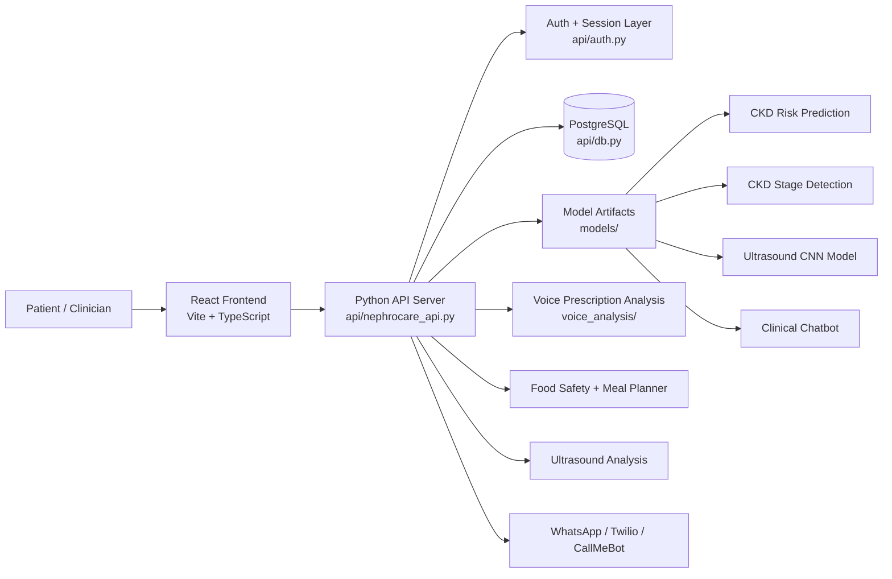
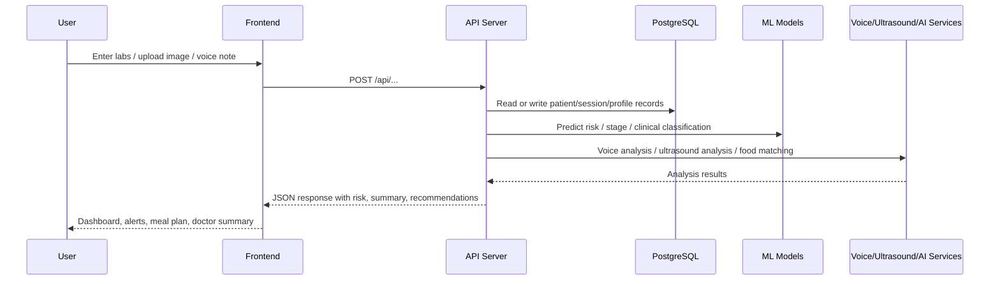
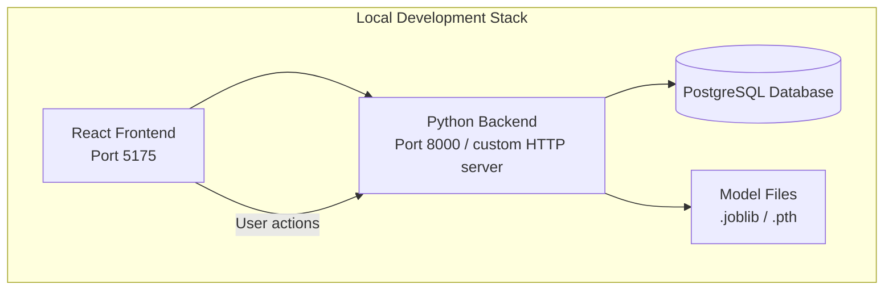
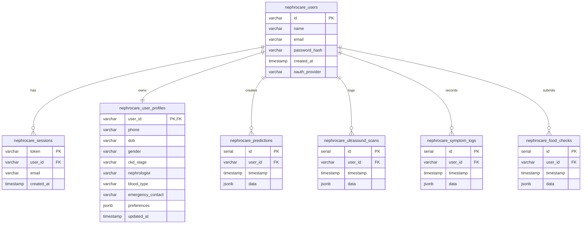

# NephroCare Technical Documentation

## 1. Project Overview

NephroCare is an AI-powered chronic kidney disease (CKD) care companion designed to help patients, caregivers, and clinicians monitor kidney health, assess risk, generate nutrition guidance, and manage ongoing care through a single dashboard. The system combines machine learning, patient data capture, voice-based prescription analysis, ultrasound diagnostics, and reminder workflows.

The platform is structured as a hybrid system:

- Python backend for data processing, ML inference, and API endpoints
- PostgreSQL-backed persistence for authentication, patient profiles, prediction history, and logs
- React + Vite frontend for patient-facing workflows and dashboards
- Optional AI integrations for food analysis, voice transcription, ultrasound interpretation, and messaging

## 2. Goals and Use Cases

The system addresses common CKD management pain points:

- Early identification of risk from routine clinical labs
- CKD staging using eGFR and urine ACR related features
- Personalized kidney-safe food analysis and meal suggestions
- Ultrasound-based structural assessment of renal abnormalities
- Voice prescription parsing and medication alerting
- Clinical summary generation for nephrologist review
- Health reminders via WhatsApp or local notification workflows

## 3. High-Level Architecture

### 3.1 System Architecture Overview



### 3.2 Request and Data Flow



### 3.3 Runtime Deployment View



## 4. Repository Structure

```text
nephrocareai/
├── api/
│   ├── auth.py                  # Authentication and session helpers
│   ├── db.py                    # PostgreSQL schema and CRUD helpers
│   ├── nephrocare_api.py        # Main REST API server
│   ├── ultrasound_dataset.py    # Ultrasound dataset utilities
│   ├── ultrasound_explain.py    # Explainability helpers
│   ├── ultrasound_model.py      # PyTorch model wrapper
│   ├── ultrasound_pipeline.py    # Ultrasound inference pipeline
│   └── ultrasound_train.py       # Training entry point
├── data/
│   ├── processed/               # CKD and nutrition datasets
│   └── raw/                     # Raw FNDDS / food metadata
├── docs/
│   ├── commands.md
│   ├── db.md
│   ├── wearable.md
│   └── technical_documentation.md
├── frontend/
│   ├── src/                    # React application source
│   ├── package.json
│   ├── vite.config.ts
│   └── tsconfig.json
├── models/
│   ├── chatbot.py               # AI nephrologist chatbot logic
│   ├── ckd_risk_prediction_model.joblib
│   ├── ckd_stage_xgb.joblib
│   ├── kidney_ultrasound_model.pth
│   └── ...
├── scripts/
│   ├── extract_datasets.py
│   ├── run_nephrocare_demo.sh
│   ├── ultrasound_scanner.py
│   └── ...
├── tests/
│   └── test_extract_datasets.py
├── voice_analysis/
│   ├── api_routes.py
│   ├── config.py
│   ├── models.py
│   ├── prescription_parser.py
│   ├── report_generator.py
│   ├── risk_scorer.py
│   ├── speech_to_text.py
│   └── voice_analyzer.py
├── README.md
├── requirements.txt
└── .env.example (if present in deployment setup)
```

## 5. Core System Components

### 5.1 Backend API Server

The main backend is implemented in `api/nephrocare_api.py` and runs as a lightweight Python HTTP service using `BaseHTTPRequestHandler` and `ThreadingHTTPServer`, rather than a framework like FastAPI or Flask.

Responsibilities:

- Expose JSON endpoints for patient auth, profile updates, predictions, lab parsing, food analysis, wearable telemetry, and chatbot queries
- Load ML model artifacts from the `models/` directory
- Normalize and validate input before prediction or storage
- Store patient records and logs in PostgreSQL via `api/db.py`
- Serve reminder and telemetry flows used by the frontend dashboard
- Trigger image analysis, voice analysis, and WhatsApp message dispatch workflows

The server uses a permissive CORS policy for local development and handles both GET and POST requests across a broad set of CKD care features.

### 5.2 Authentication and Session Layer

`api/auth.py` handles:

- SHA-256 password hashing
- session token creation
- login, signup, logout, and Google auth flows
- token verification for protected endpoints

The API expects a bearer token in the `Authorization` header for authenticated routes.

### 5.3 Database Layer

`api/db.py` provides PostgreSQL connectivity and schema initialization. The database is built around a patient-centered model where each user can have multiple sessions, profile records, predictions, ultrasound scans, symptom entries, and food safety checks.

#### 5.3.1 Database Schema Relationship Diagram



#### 5.3.2 Schema Design Notes

- `nephrocare_users` stores authentication identity and account metadata.
- `nephrocare_sessions` tracks active bearer tokens for authenticated requests.
- `nephrocare_user_profiles` stores patient profile data such as stage, doctor contacts, and preferences.
- All analysis-heavy records use `JSONB` payloads for flexible storage of model outputs, parsed lab values, and scan results.
- This design allows rapid extension without reshaping the database schema for each medical feature.

Most patient-specific records are stored as JSONB values, which allows flexible capture of lab data, risk metrics, and analysis results.

### 5.4 Frontend Application

The frontend is a Vite React single-page application under `frontend/src` and is wired to the Python backend through `/api/*` requests.

Primary screens and modules include:

- Auth and account management
- CKD risk prediction calculator and lab form workflow
- Dashboard and patient summary overview
- Lab report extraction and parsing
- Food safety and meal-planning tools
- Ultrasound image analysis
- Chatbot medical assistant
- Voice prescription analysis
- Alerts, reminders, and settings

The client also uses `localStorage` to maintain reminder preferences, WhatsApp settings, and background notification history; this is explicitly visible in the client reminder engine inside the React app.

## 6. Machine Learning and AI Components

### 6.1 CKD Risk Prediction

The project loads a trained joblib model from `models/ckd_risk_prediction_model.joblib` and supporting artifacts from:

- `uci_scaler.joblib`
- `uci_feature_names.joblib`
- `uci_encoders.joblib`

These are used for tabular prediction based on patient lab values and demographics such as:

- age
- sex
- urine albumin
- blood pressure
- blood glucose
- blood urea
- serum creatinine
- sodium
- potassium
- hemoglobin
- hypertension
- diabetes mellitus

### 6.2 CKD Stage Prediction

The project includes stage-detection logic and model artifacts such as:

- `models/ckd_stage_xgb.joblib`
- `models/ckd_stage_scaler.joblib`
- `models/ckd_stage_features.joblib`
- `models/ckd_stage_label_encoder.joblib`

This component estimates kidney disease stage using clinical markers such as eGFR, albumin-creatinine ratio, and stage-related thresholds.

### 6.3 Ultrasound Analysis

The ultrasound pipeline includes:

- `api/ultrasound_model.py`
- `api/ultrasound_pipeline.py`
- `scripts/ultrasound_scanner.py`
- model file `models/kidney_ultrasound_model.pth`

The workflow performs:

1. image upload
2. CNN-based classification
3. optional AI vision interpretation
4. merged output with severity and recommendation text
5. fallback report generation when external analysis is unavailable

### 6.4 Food Recommendation Engine

The food logic combines:

- processed dataset `data/processed/indian_ckd_foods.csv`
- raw USDA food tables in `data/raw/food_data_csv/`
- nutrition matching and recommendation heuristics

This engine supports:

- food safety classification
- kidney-safe meal planning
- dietary stage-based suggestions
- meal recommendation logic for hypertension and diabetes scenarios

### 6.5 Voice Prescription Analysis

The `voice_analysis/` package handles:

- audio upload parsing
- transcription via Whisper-style processing
- prescription extraction
- medication and nutrient review
- risk scoring and recommendations

It is designed to parse clinical instructions from recorded voice notes and summarize health issues for patient guidance or physician review.

### 6.6 Chatbot

`models/chatbot.py` contains a specialized conversational assistant that evaluates kidney-related patient questions with additional patient context such as stage, lab values, medications, and comorbidities.

## 7. API Endpoints

### 7.1 Authentication and User Session

| Endpoint | Method | Purpose |
|---|---|---|
| `/api/auth/signup` | POST | Create a new account |
| `/api/auth/login` | POST | Authenticate and return a bearer token |
| `/api/auth/logout` | POST | End session |
| `/api/auth/google` | POST | Google authentication flow |
| `/api/auth/password` | POST | Update password |
| `/api/auth/me` | GET | Fetch current authenticated user |

### 7.2 Patient Profile and History

| Endpoint | Method | Purpose |
|---|---|---|
| `/api/patient/profile` | GET/POST | Load or update patient profile |
| `/api/patient/history` | GET | Retrieve patient history |
| `/api/patient/predictions` | POST | Store risk predictions |
| `/api/patient/ultrasound-scans` | POST | Store ultrasound scan data |
| `/api/patient/symptom-logs` | POST | Store symptoms |
| `/api/patient/food-checks` | POST | Store food analysis results |

### 7.3 Prediction and Clinical Analytics

| Endpoint | Method | Purpose |
|---|---|---|
| `/api/predict` | POST | Run CKD risk prediction on structured lab inputs |
| `/api/predict-stage` | POST | Estimate CKD stage |
| `/api/lab-defaults` | GET | Return default clinical field values |
| `/api/health` | GET | Check backend health and model availability |

### 7.4 Food / Nutrition Tools

| Endpoint | Method | Purpose |
|---|---|---|
| `/api/food-defaults` | GET | Food-stage defaults |
| `/api/food-analyze` | POST | Analyze specific food item |
| `/api/food-recommendations` | POST | Generate kidney-safe recommendations |
| `/api/meal-plan` | POST | Create a meal plan |
| `/api/scan-food-image` | POST | Upload food image for analysis |

### 7.5 Medical Imaging and Voice

| Endpoint | Method | Purpose |
|---|---|---|
| `/api/scan-ultrasound` | POST | Run ultrasound image analysis |
| `/api/extract-report` | POST | Parse uploaded lab report text |
| `/api/voice/analyze` | POST | Analyze voice prescription audio |

### 7.6 Chat and Alerts

| Endpoint | Method | Purpose |
|---|---|---|
| `/api/chatbot/chat` | POST | Query the nephrology assistant |
| `/api/send-whatsapp` | POST | Send WhatsApp reminder or message |
| `/api/wearable/telemetry` | GET/POST | Read or update wearable telemetry |

## 8. Data Flow Overview

### 8.1 Patient Risk Prediction Flow

1. User enters lab values or uploads report text.
2. API validates and normalizes the payload.
3. Model loads joblib pipeline artifacts.
4. Backend returns risk classification and supporting metrics.
5. Prediction is stored into `nephrocare_predictions`.
6. Frontend renders risk summary and recommendations.

### 8.2 Ultrasound Flow

1. User uploads kidney ultrasound image.
2. Server saves the image temporarily.
3. CNN pipeline predicts abnormality class.
4. Optional vision-based analysis is attempted.
5. Output is merged and fallback report is applied if needed.
6. Scan result is stored as JSON and displayed to the user.

### 8.3 Voice Prescription Flow

1. Audio file is submitted via multipart form.
2. Voice analyzer extracts transcript and clinical signals.
3. Risk and medication issues are inferred from the transcript.
4. Recommendations and summary are returned for patient or doctor review.

## 9. Environment and Configuration

The backend expects configuration variables such as:

- `DATABASE_URL`
- `TWILIO_ACCOUNT_SID`
- `TWILIO_AUTH_TOKEN`
- `TWILIO_FROM_NUMBER`
- `CALLMEBOT_API_KEY`
- AI provider credentials for Gemini / OpenAI-style integrations if enabled

The application loads `.env` values through `python-dotenv` and the server falls back to default local values when environment variables are not present.

## 10. Local Startup

### Prerequisites

- Python 3.10+
- Node.js 18+
- PostgreSQL instance or configured local database
- Python virtual environment

### Install and run

```bash
python3 -m venv .venv
source .venv/bin/activate
pip install -r requirements.txt
python scripts/extract_datasets.py
bash scripts/run_nephrocare_demo.sh
```

The startup script in `scripts/run_nephrocare_demo.sh` launches the backend and frontend together:

- backend: `api/nephrocare_api.py`
- frontend: `cd frontend && npm run dev -- --host 0.0.0.0 --port 5175`

Current app endpoints are served on the local dev stack, with the frontend typically exposed on port `5175` while the Python service handles `/api/*` routes.

## 11. Frontend Build Notes

The React UI is built with Vite and TypeScript. Typical commands:

```bash
cd frontend
npm install
npm run build
npm run dev -- --host 0.0.0.0 --port 5175
```

The app is designed to work as a local health dashboard or demo environment, with dynamic reminder and telemetry logic in the client.

## 12. Persistence and Storage Design

The database design centers on:

- users and sessions
- patient profiles and metadata
- event-based clinical records
- JSONB payload flexibility for varied analysis outputs

This choice supports rapid iteration and avoids rigid schema expansion for medical features that evolve over time.

## 13. Security and Operational Notes

Important considerations for real-world deployment:

- Use strong secret management for database credentials and API keys
- Restrict CORS in production rather than allowing all origins
- Move auth and sessions to a production-grade identity system if used outside demo mode
- Validate all medical inputs before sending to ML and AI components
- Ensure no patient data is exposed without proper authorization
- Treat model outputs as decision support only and not as confirmed diagnoses
- Keep PostgreSQL and dependency credentials in `.env` or a secure deployment secret manager, not in source-controlled files

## 14. Current Repository Reality

This codebase is a modular, locally hosted healthcare prototype that blends:

- a custom Python HTTP server for API endpoints
- a PostgreSQL-backed patient/auth store
- a Vite React front-end with page-based dashboards and reminders
- ML, voice, food, and image-analysis features built around real project artifacts in `models/`, `data/`, and `voice_analysis/`

This means the documentation reflects the current implementation and not a generic FastAPI/Node stack.

## 14. Limitations and Design Constraints

- The project is best described as a clinical decision-support prototype and not a regulated medical device
- Several features rely on local demo logic and optional external AI services
- Some endpoints are intentionally permissive to support development ease and local demos
- PostgreSQL initialization is important; backend behavior may change if the database is unavailable
- AI and voice features can fail gracefully, but their output should be manually reviewed

## 15. Summary

NephroCare is a modular health-tech prototype that combines clinical risk modeling, dietary optimization, AI-powered ultrasound diagnostics, voice prescription extraction, and patient engagement tools into a unified care dashboard. The system is designed to support proactive CKD management in a low-friction, patient-friendly format while remaining adaptable for further clinical or deployment integration.
